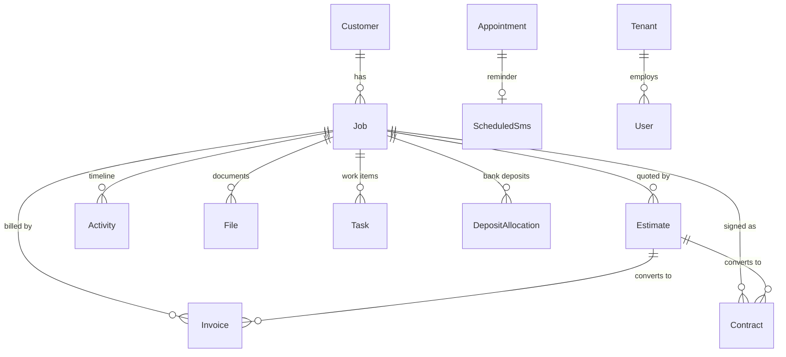

# Paarth

**An operations platform built to run a custom woodworking and stair-manufacturing business — not a generic CRM with a construction theme.**

Paarth is the system of record for San Clemente Woodworking. Every job that enters the shop lives here from the first phone call to the final payment: the estimate, the signed contract, the deposit that cleared the bank, the takeoff measurements, the installer assigned to Tuesday, the text message that told the customer their stairs were ready, and the commission the salesman earned when the check arrived. One database, one timeline per job, one place to look.

It is built for the way a real shop actually works. The owner opens it on a laptop. The salesman checks the pipeline from a phone in a customer's driveway. A TV on the shop wall shows the board and the install calendar all day without anyone touching it. A Raspberry Pi by the door reads RFID badges and turns them into timesheets. Nobody has to be at a desk for the business to keep running.

---

## Contents

- [Who uses it, and on what](#who-uses-it-and-on-what)
- [The pipeline](#the-pipeline) — the heart of the app
- [Scheduling and the install calendar](#scheduling-and-the-install-calendar)
- [Mobile messaging](#mobile-messaging)
- [Real-time updates](#real-time-updates)
- [What it keeps track of](#what-it-keeps-track-of)
- [Money](#money)
- [The shop floor](#the-shop-floor)
- [Interface and experience](#interface-and-experience)
- [Architecture](#architecture)
- [Security and access control](#security-and-access-control)
- [Repository layout](#repository-layout)
- [Getting started](#getting-started)
- [Background jobs](#background-jobs)
- [Known gaps and roadmap](#known-gaps-and-roadmap)
- [Further documentation](#further-documentation)

---

## Who uses it, and on what

| Person | Device | What they need |
|--------|--------|----------------|
| Owner / admin | Desktop | Everything: finance, users, website, analytics, bank register |
| Salesman | Phone and laptop | Pipeline, customers, calendar, their commission log |
| Shop lead | Wall-mounted TV | The board and the install calendar, read-only, never logs out |
| Installer | Phone | Where they are going, who the customer is, what the address is |
| Shop employee | RFID badge or kiosk PIN | Clock in, clock out |
| Office | Desktop | Estimates, invoices, contracts, bills, payroll, messages |

The same application serves all of them. What changes is what each one is allowed to see and how the interface reshapes itself for the screen it is on — covered in [Interface and experience](#interface-and-experience).

---

## The pipeline

The pipeline is a Kanban board, but it is modelled on how a stair job actually progresses rather than on generic "to do / doing / done" columns. Twelve stages are grouped into three phases that match the three real handoffs in the business: selling the job, getting it ready to build, and executing it.

```
SALES PHASE
  Estimate Current, first 5 days │ Estimate Sent │ Design Review │ Contract Out

JOB READINESS
  Signed / Deposit Pending │ Job Prep │ Fabrication │ Ready to Schedule

EXECUTION PHASE
  Scheduled │ In Production │ Installed │ Final Payment Closed
```

A thirteenth stage, **Appointment Scheduled**, sits ahead of the board. Pre-sales appointments are not jobs yet, so they live in their own list beside the board instead of as a column.

### Moving work through it

Jobs are dragged between columns with native HTML5 drag and drop. On drop, the board:

1. Updates the card's position **immediately** in local state, before the server answers, and rolls it back if the request fails. The board never feels like it is waiting on the network.
2. Calls `POST /jobs/:id/move-stage`, which records the stage change on the job's activity timeline server-side, so there is a permanent audit trail of who moved what and when.
3. Checks whether the destination stage has an enabled SMS template. If it does, a dialog opens pre-filled with the customer's message — "your estimate is on the way", "we're scheduling your install" — and the user can send it or dismiss it. The text is always optional and never blocks the move.
4. Broadcasts the change to every other connected browser, so the shop TV and the owner's laptop update within a second. See [Real-time updates](#real-time-updates).

Templates are configured per stage and stored on the tenant, so each business writes its own customer-facing language once and then reuses it on every job.

### The job card

Cards are deliberately sparse. A column is narrow, and a board with sixty jobs on it has to be readable at a glance from across a room, so a card shows the customer or job name, a coloured left edge, and nothing else it can avoid.

The colour of that left edge answers the single most common question in the shop — *is this job actually going to happen this week?*

| Colour | Meaning |
|--------|---------|
| **Green** | Scheduled — it has install dates on the calendar, or it sits in the Scheduled stage |
| **Orange** | On the bench — it is ready to build but has no dates yet |
| **Blue** | Open — still in sales, or otherwise not yet a production commitment |

That distinction between *scheduled* and *on the bench* is the one the whole calendar is built around, and it is explained below.

### Board-level tools

- **Stage totals.** Each column header can show the summed estimated value of the jobs in it, formatted compactly (`$1.2K`, `$450K`). This is money on the screen, so it sits behind the financial PIN gate and is hidden entirely for shop-floor roles.
- **Search** filters across job title, customer name, and stage, and searches every job rather than only the current board.
- **Right-click any job** for a context menu: move to a stage, add a change order, add a task, edit the payment schedule, archive it.
- **Close out completed jobs.** When jobs pile up in Final Payment Closed, one control archives them in bulk after a confirmation, keeping the board honest without losing history.
- **Custom boards.** A tenant can define alternate pipeline layouts with their own phase titles and their own stage keys, and jobs are filed against the layout they belong to. Stage labels, descriptions, and visibility on the default board are also overridable per tenant, so a business can rename "Fabrication" to whatever its crew actually calls it, or hide a stage it does not use.
- **Fullscreen / TV mode** at `/pipeline-view` strips the board down for a wall display: no task lists, no appointment panel, no SMS prompts, no sidebar, and a long-lived kiosk session so the screen survives a power cycle without someone typing a password.

---

## Scheduling and the install calendar

The calendar is a month grid, but the interesting part is the **bench** beside it.

A job is "on the bench" when it is sold, prepped, and buildable but has no install dates yet. Those jobs are the shop's backlog — real committed work with real revenue attached, waiting for a slot. The calendar shows the bench as a live list next to the month so that whoever is scheduling can see the backlog and the open days at the same time, which is the actual job to be done.

- **Bench and scheduled lists** are drag-and-drop between each other. Pulling a job back to the bench sets a `returnToBench` flag that parks it *without* destroying its dates or colour, so nothing is lost when plans slip.
- **Dates and installers** are assigned by clicking a day, which opens a scheduling dialog supporting multiple installer-and-date groups on one job. A job can have two installers on different weeks, or one installer across a ten-day range, with weekends automatically excluded when a range is expanded.
- **Multi-day jobs** render as continuous bars across the days they span.
- **Installer lanes.** Each day cell lays out up to four named installer lanes plus an "Other" lane, so the grid reads as a crew schedule rather than an undifferentiated pile of chips. Lane order is a user preference.
- **Colour** is per job and carries through the bench card, the scheduled list, and the grid, so a long-running job is recognisable everywhere.
- **Hidden weekdays.** A shop that never installs on Sundays can right-click a day header and remove that column from the grid permanently, reclaiming the space. TV mode always shows the full week.
- **Holidays** (US federal plus Easter) are marked on day headers, because they are the thing people forget when promising a date.
- **Duration estimate.** Bench cards show a rough day count derived from job value, giving the scheduler a sense of size before they commit a slot.
- **TV mode** at `/calendar-view` shows multiple months at once for wall display.

On a phone the calendar becomes read-only and reshapes completely — see [the mobile experience](#the-mobile-experience).

---

## Mobile messaging

Paarth sends and receives real SMS through Twilio, in both directions, and keeps the whole conversation in the job record.

### Outbound

| Kind | Where it comes from |
|------|--------------------|
| Ad-hoc | The Messages page, to any number the user types |
| Pipeline stage templates | Offered automatically when a job moves stage |
| Appointment reminders | Queued when an appointment is booked, keyed to the appointment |
| Payment notifications | Fired automatically when a payment is marked paid, to a configured recipient list |
| Employee and customer texts | From the job modal, customer page, vendor page, and calendar — including sharing a job's schedule and address with an installer |

Recipients can be resolved from the employee roster rather than retyped, and messages can be **scheduled for the future** rather than sent now. Images can be attached via a staged MMS upload.

### Inbound

Replies come back. A public webhook at `POST /twilio/sms` receives Twilio's callback, infers which tenant the message belongs to (by prior conversation thread, then by the number it was sent from, then by fallback), and stores it as an inbound message. Delivery receipts arrive on a separate status callback and update each message's delivery state.

Because webhooks can be misconfigured or miss a window, there is also an admin-only **backfill**: one button pulls recent messages straight from the Twilio API and reconciles anything the webhook missed.

Unread replies surface as a **badge in the sidebar**, polled on an interval and refreshed immediately when the user reads a thread, so a reply is never silently sitting in a page nobody opened.

A public `/sms-consent` page carries the A2P compliance copy required for campaign registration.

### Scheduled delivery

A scheduler inside the API process wakes every minute, claims scheduled messages whose send time has passed, sends them in small batches, and refreshes stale delivery statuses from Twilio. No separate worker process to deploy or babysit.

---

## Real-time updates

Paarth is a multi-user application where two people genuinely do touch the same job at the same time — a salesman moving a card while the shop lead schedules it. Rather than making users refresh, the server pushes changes over Socket.IO.

**Rooms are per tenant.** On connect, an authenticated socket joins `tenant:{tenantId}`, and every broadcast is scoped to that room, so one business never receives another's events. Clients can additionally subscribe to a specific `project:` or `task:` topic for finer-grained updates.

Events the server emits:

| Event | Fires when |
|-------|-----------|
| `project.created` / `project.updated` | A job is created, edited, moved stage, archived, or deleted |
| `task.created` / `task.updated` | A task is created, edited, completed, or removed |
| `appointment.changed` | An appointment is booked, edited, completed, cancelled, or deleted |
| `customer.changed` | A customer is created, edited, or deleted |
| `rfid.scan.created` | A badge is scanned at the shop reader |
| `rfid.tag.*`, `rfid.pin.*`, `rfid.timesheet.updated`, `rfid.employee-profile.updated` | Timekeeping configuration or timesheet changes |
| `user.audit.created` | Audit activity is ingested |
| `website.analytics.created` | A visitor event lands from the public marketing site |

On the client, two hooks do the work:

- **`useSocketSubscription(room, event, handler)`** — ref-counted room joins, automatic re-subscription after a reconnect, and cleanup on unmount.
- **`useTenantRealtimeRefresh(room, refresh)`** — a debounced refetch for pages that just need to stay fresh.

Two details matter more than they look:

1. **Debounced refetch.** A burst of twenty events produces one refetch, not twenty. A busy afternoon does not turn into a stampede on the API.
2. **Ignoring your own writes.** Every HTTP request carries the browser's socket id in a header, and the server echoes it back on the resulting broadcast. The originating tab recognises its own id and skips the refresh, because it already applied the change optimistically. Without this, the user who moved a card would see it jump as their own echo came back.

---

## What it keeps track of

Thirty-one collections, every one of them scoped to a tenant. The core thread is **Customer → Job**, and almost everything else hangs off a job.



### The job record

A job is the richest document in the system, because in this business a job *is* the unit of work. One job holds:

- **Where it stands** — current pipeline stage, which board it belongs to, who it is assigned to
- **What it is worth** — estimated value and contracted value, tracked separately
- **How it gets paid** — a full payment schedule of percentage or fixed-amount milestones, each with a due type (deposit, milestone, final), its own status (pending, invoiced, paid), and its own dates
- **Change orders** — each billed separately or rolled into the final payment, each with its own paid status
- **Measurements** — the complete takeoff sheet, saved as structured data, with who completed it and when
- **The install plan** — start and end dates, installers, multiple scheduled entries, crew notes, calendar colour, and a flag for jobs parked back on the bench
- **Where it is** — job site address and on-site contact, which are often not the customer's billing details
- **How it closed** — final payment method, close-out state, archive state, and a "dead estimate" flag for jobs that never happened
- **Its whole story** — a notes timeline where stage changes, appointments, and flagged important notes are interleaved with free text

### Everything else

| Domain | Collections | What it is for |
|--------|-------------|----------------|
| **Sales** | `Customer`, `Job`, `Appointment`, `PipelineLayout` | Leads, jobs, site visits, custom boards. Customers carry multiple labelled phones, emails, and addresses, plus a lead source and referral company so marketing spend can be judged |
| **Money** | `Estimate`, `Contract`, `Invoice`, `DocumentSequence`, `DepositAllocation`, `PlaidRegisterCache`, `Bill` | Numbered financial documents, their counters, bank reconciliation, recurring bills |
| **Work** | `Task`, `Activity`, `File`, `DocumentFolder` | To-dos (which can nest under a parent to form projects), the audit timeline, uploads, and a folder tree |
| **Messaging** | `SmsMessage`, `ScheduledSms`, `OutlookMessage`, `EmployeeContact` | Sent and received texts, the outbound queue, synced email, and the roster of staff without logins |
| **Shop floor** | `RfidTag`, `RfidPin`, `RfidScan`, `RfidEmployeeProfile`, `RfidTimesheetWeek` | Badges, kiosk PINs, raw scans, pay rates and shift defaults, compiled timesheets |
| **Suppliers** | `Vendor` | Lumber, hardware, subcontractors, delivery, with reusable order-item catalogues |
| **Marketing** | `WebsiteContent`, `WebsiteAnalyticsEvent` | The public site's CMS and first-party visitor analytics |
| **Platform** | `Tenant`, `User`, `UserAuditLog`, `DeveloperTask` | Organisations, logins, a security audit trail, and the internal engineering backlog |

The **activity log** deserves a mention on its own: it recognises more than forty distinct event types — stage changes, payments received, deposits, files uploaded and deleted, estimates sent, contracts signed, takeoffs completed, payroll printed, appointments created and completed, tasks opened and closed. The result is that any job, customer, or task can answer "what has happened here?" without anyone having kept notes by hand.

---

## Money

A woodworking business lives or dies on deposits, progress payments, and final balances actually being collected. Paarth treats that as a first-class workflow rather than an export to a spreadsheet.

### Documents

**Estimates, contracts, and invoices** are separate numbered document types, each with its own per-tenant sequence counter so numbers never collide or repeat. An estimate carries line items, tax, discounts, and a grand total, and moves through a real lifecycle — draft, sent, approved, rejected, superseded, converted, archived. Approved estimates convert into contracts and invoices, and the derived documents stay linked back to the estimate that produced them, so a disputed invoice can be traced to the quote it came from. Invoices know what kind they are (deposit, final, full, or change order) and track a running balance due. PDFs are generated in the browser.

### Payment schedules

Rather than a single "amount owed", a job holds an ordered schedule of payment milestones — the standard 40/60 split, or anything custom. Each line can be a percentage or a fixed amount, knows whether it is a deposit, a milestone, or the final balance, and carries its own status and dates. The pipeline, the commission log, and the payment notification system all read from this one structure, so "what is owed on this job" has exactly one answer.

### Bank reconciliation

The tenant can link a real bank account through Plaid. Transactions and balances are cached server-side for the finance register, and **deposits are matched against job payment schedules**: a bank deposit can be linked to a specific milestone on a specific job, which optionally marks that milestone paid. The matching is recorded as its own record, so the link between "money arrived in the account" and "this job's deposit is satisfied" is auditable rather than remembered.

### Commissions

The commission log is a dense, purpose-built grid rather than a report. It shows every job's payment tiers side by side, groups payouts by the physical check or cash payment they were paid with, lets rows and payments be reordered by drag, and expands each check to show the individual payments inside it. Salesmen can see what they have earned and, more importantly, what they have not been paid yet.

### Also

- **Bills** — recurring company obligations (utilities, rent, insurance, software) with a due day of the month and a link to the payment portal
- **Payroll** — timesheets and mileage with print-optimised output, because this is a document that gets signed on paper

---

## The shop floor

The parts of the business that happen away from a computer.

**RFID time clock.** A Raspberry Pi with an MFRC522 reader sits at the shop entrance running a small Python script that posts every badge scan to the API, authenticated with a device key and a tenant header rather than a user login. Each employee has a badge, and a four-digit kiosk PIN as a fallback for a lost or forgotten one. Scans stream into the app in real time.

**Timesheets.** Raw scans are compiled into weekly timesheets on a Friday-to-Thursday pay period. The current week is editable — because readers get missed and people forget to clock out — while past weeks lock as a record. Each employee has shift defaults, a break allowance, and an hourly rate, and each week can carry extra hours, expense receipts, and travel mileage.

**Takeoff sheet.** A measurement tool built for the way takeoffs are actually written: room-by-room rows, fractional measurements, autofill from the job, tab-completion for repeated values, local persistence so a half-finished sheet survives a closed tab, and PDF export. The completed sheet saves back onto the job as structured data.

**Vendors.** Suppliers and subcontractors with contact details and reusable order-item catalogues, so re-ordering the same stair parts does not mean re-typing part numbers.

---

## Interface and experience

The functionality above is only useful if people actually use it, and the people using it are a shop crew, not software operators. A large share of the work in this codebase is in making the interface disappear.

### The mobile experience

The mobile build is not a responsive afterthought — it is a deliberately reduced product. On a phone, **five pages exist**: Calendar, Pipeline, Customers, Commission Logs, and Website Analytics. Everything else is hidden from navigation *and* blocked at the router, with a single allowlist shared by the drawer and the route guard so the two can never drift apart. The phone's home page is the Calendar, not the dashboard, because the first question in a driveway is "where am I supposed to be?"

Each surviving page was then reshaped rather than shrunk:

| Page | On a phone |
|------|-----------|
| **Pipeline** | All twelve columns fit the screen at real font sizes, in narrow square panes with label-only headers, minimal gaps, and name-only cards. Totals, counts, search, the board picker, and the new-job button are all stripped. The board renders at native size — no CSS zoom, which collapses glyphs below roughly half scale |
| **Calendar** | Read-only. The bench and scheduled lists are gone. Day cells show coloured bars instead of unreadable text chips. Tapping a day opens the whole week's schedule with customer, installer, location, and a tap-to-call button. Swiping changes month. An "Upcoming jobs" list sits below the grid |
| **Customers** | Name, phone, and address only; tap a row for email, source, and notes |
| **Commission Logs** | Checks and cash first, numeric dates, payment tiers locked to one line, and the columns that only matter at a desk removed |

Smaller decisions throughout: dialogs go nearly full-bleed instead of floating in MUI's default margin, headings shrink, table gutters tighten, buttons lose their desktop padding, and the financial PIN gate is skipped entirely because a phone is already a personal device. The dark-mode toggle was moved out of the top bar — it sat beside the avatar where a thumb hits it by accident — and into the user menu with an explicit label.

### Design system

A single theme provider defines light and dark palettes, responsive typography that steps down at the mobile breakpoint, and component-level overrides: buttons that are not shouty all-caps, cards that lift on hover, a gradient app bar, and mobile-specific rules for dialogs and table cells. Mode is remembered per browser and defaults to light.

### Interaction details

- **Optimistic updates** on pipeline stage moves, with rollback on failure
- **Debounced realtime refetches**, and the self-echo suppression described [above](#real-time-updates)
- **Right-click context menus** on jobs, calendar events, and day headers, so power users get depth without the primary interface growing buttons
- **Tooltips** that explain what a stage means and what a status colour implies, rather than restating the label
- **Confirmation dialogs** on destructive and bulk actions — archiving, closing out, deleting schedule entries
- **Print stylesheets** on payroll and the dashboard day sheet, because those are documents that leave the screen
- **Empty states** written as guidance rather than "No data"
- **Kiosk mode** with a floating view switcher, a long-lived session so wall displays never log out, and a PIN to leave the display and get back to the app
- **Accessibility** touches: `aria-label` on icon-only buttons, `title` on truncated text so a clipped job name is still readable on hover, and `role="img"` on the hand-rolled analytics chart
- **Deep links** throughout — `?jobId=`, `?customerId=`, `?tab=` — so a page can be shared or bookmarked in the state you were looking at

### Sensitive data on shared screens

A board on a shop wall should not display what every job is worth to anyone walking past, and a shop-floor login should not reveal margins. Two independent gates handle this: a role-based filter that hides dollar amounts from shop-view users, and a session-scoped PIN lock that hides financial amounts across the pipeline, customers, calendar, and job modal until it is unlocked. Both are deliberately client-side deterrents for shoulder-surfing on shared hardware, not a substitute for the server-side role checks that protect the finance pages themselves.

---

## Architecture

| Layer | Technology |
|-------|-----------|
| Frontend | React 19, Vite, TypeScript, Material UI 7, React Router 7, Axios, Socket.IO client, date-fns, dnd-kit (sortable grids), jsPDF + html2canvas, pdf.js |
| Backend | Node.js, Express 5, Mongoose 9, JSON Web Tokens, Socket.IO |
| Database | MongoDB, multi-tenant |
| Files | AWS S3 in production, local disk in development, chosen automatically |
| Integrations | Twilio (SMS), Plaid (banking), Microsoft Graph (email), Google Calendar, OpenAI (summaries and in-app assistant) |

### Multi-tenancy

Tenant isolation is enforced at the data layer, not sprinkled across controllers. A Mongoose plugin applied to every model adds an indexed `tenantId`, sets it automatically on save, and **rewrites every query and aggregation** to filter by the tenant in the current request's async-local context. Authentication middleware establishes that context before a route handler runs. A controller cannot accidentally leak another tenant's data by forgetting a filter, because the filter is not the controller's job. The few places that legitimately need to read across tenants — loading the user during login, for instance — opt out explicitly.

Each tenant carries its own branding, estimate document header, pipeline stage overrides, SMS templates, notification recipients, and integration credentials, so the platform genuinely supports more than one business rather than being one business's app with a tenant column bolted on.

### Request lifecycle

```
Browser
  │  Authorization: Bearer <jwt>
  │  x-tenant-id: <tenant>
  │  x-socket-id: <this tab's socket>
  ▼
Express  →  tenant resolution  →  requireAuth (verify JWT, load user)
                                    │
                                    ▼
                          runWithTenantContext()
                                    │
                    ┌───────────────┼───────────────┐
                    ▼               ▼               ▼
               controller      Mongoose        eventBus
                               (auto-scoped)   emits to tenant room
                                                    │
                                                    ▼
                                            every other open tab
```

---

## Security and access control

Access tokens are time-limited JWTs — 24 hours by default — paired with longer-lived refresh tokens; kiosk sessions get a deliberately extended lifetime so wall displays survive restarts. Passwords are bcrypt-hashed, and the user serialiser strips the hash before anything leaves the server.

Eight roles exist:

| Role | Intended for |
|------|-------------|
| `super_admin` | Owner — finance, users, website, bank links, analytics |
| `admin` | Office manager — everything operational, plus the team inbox |
| `manager`, `sales` | Day-to-day CRM work; may link banking |
| `installer`, `employee` | Field and shop staff |
| `shop_view` | Wall displays and shop terminals; dollar amounts hidden |
| `read_only` | Observers |

Super-admin-only areas are guarded on both sides: the router refuses to render them and the API refuses to serve them. Finance, user administration, bills, the website CMS, analytics, and the developer backlog all sit behind that gate. Twilio configuration and inbound backfill are admin-or-above. Bank linking is restricted to a named set of roles.

Every authenticated session also writes an audit trail — logins, logouts, page views, and clicks, with IP-derived location — queryable by super admins.

> **Note on PINs.** The two PIN gates described earlier protect against someone reading a shared screen. They are client-side by design and are not an authorisation boundary; the server-side role checks are.

---

## Repository layout

```
Paarth/
├── frontend/                 React SPA
│   └── src/
│       ├── pages/            33 route-level pages
│       ├── components/       pipeline/, jobs/, finance/, layout/, common/, …
│       ├── context/          auth, theme, financial PIN lock
│       ├── hooks/            useIsMobile, useSocketSubscription, PIN gates
│       ├── services/         socket client
│       └── utils/            axios, payment schedules, SMS templates, mobile nav
├── backend/                  Express API
│   └── src/
│       ├── models/           31 Mongoose models + tenant-scope plugin
│       ├── controllers/      request handlers
│       ├── routes/           26 route modules
│       ├── services/         socket server, event bus, Plaid, Outlook, deposits, notifications
│       ├── middleware/       auth, tenant resolution, uploads, RFID device auth
│       └── scripts/          tenant cloning, seeding, backfills
├── scripts/
│   └── raspberry-pi/         RFID reader → API
├── docs/                     Developer documentation
└── documents/                Deployment and integration notes
```

---

## Getting started

### Prerequisites

Node.js 20.19 or newer (required by Mongoose 9), and a MongoDB instance (local or Atlas).

### Run it

```bash
# API
cd backend && npm install && npm run dev      # http://localhost:4000

# Frontend, in a second terminal
cd frontend && npm install && npm run dev     # http://localhost:5173
```

Create the first login:

```bash
cd backend && npm run create-super-admin
```

### Configuration

`frontend/.env`:

```bash
VITE_API_URL=http://localhost:4000
```

`backend/.env` — required:

```bash
MONGODB_URI=mongodb://localhost:27017/paarth
JWT_SECRET=...
JWT_REFRESH_SECRET=...
FRONTEND_URL=http://localhost:5173
CORS_ORIGINS=http://localhost:5173
PORT=4000
```

Everything below is optional; each integration degrades gracefully when its variables are absent, and `GET /health` reports which ones are live.

| Integration | Variables |
|-------------|-----------|
| Twilio SMS | `TWILIO_ACCOUNT_SID`, `TWILIO_AUTH_TOKEN`, `TWILIO_PHONE_NUMBER`, `PUBLIC_API_BASE_URL` |
| File storage | `AWS_ACCESS_KEY_ID`, `AWS_SECRET_ACCESS_KEY`, `AWS_S3_BUCKET_NAME`, `AWS_REGION` — falls back to local `uploads/` |
| Plaid | `PLAID_CLIENT_ID`, `PLAID_SECRET`, `PLAID_ENV`, `PLAID_WEBHOOK_URL` |
| Microsoft Graph | `MICROSOFT_CLIENT_ID`, `MICROSOFT_CLIENT_SECRET`, `MICROSOFT_REDIRECT_URI` |
| Google Calendar | `GOOGLE_CLIENT_ID`, `GOOGLE_CLIENT_SECRET`, `GOOGLE_REDIRECT_URI`, `GOOGLE_REFRESH_TOKEN` |
| OpenAI | `OPENAI_API_KEY`, `OPENAI_MODEL` |
| RFID devices | `RFID_DEVICE_API_KEY`, `RFID_SHOP_TIMEZONE` |
| Email (EmailJS) | `EMAILJS_PUBLIC_KEY`, `EMAILJS_PRIVATE_KEY`, `EMAILJS_SERVICE_ID`, `EMAILJS_TEMPLATE_ID` |

For `PUBLIC_API_BASE_URL`, point Twilio's inbound webhook at `<that base>/twilio/sms` with HTTP POST.

### Checks

```bash
cd frontend && npm run build        # production bundle
cd frontend && npm run typecheck    # tsc, no emit
cd frontend && npm run lint
cd frontend && npm run test         # vitest
cd backend  && npm test             # node:test
cd backend  && npm run typecheck
```

---

## Background jobs

Started by the API process once MongoDB connects — no separate worker to deploy:

| Job | Schedule | Purpose |
|-----|----------|---------|
| SMS scheduler | Every minute | Send due scheduled messages, refresh delivery statuses |
| Outlook inbox sync | 90s after boot, then every 15 minutes | Pull worksheet emails into the team inbox |
| Plaid refresh | Daily, Pacific time | Re-sync bank transactions and balances |

---

## Known gaps and roadmap

Documented honestly, because knowing where the edges are is part of running the thing:

- **Touch drag on the pipeline.** The board uses native HTML5 drag and drop, which does not fire on touch devices. The mobile board is intentionally read-only as a result; moving a job on a phone needs a pointer-event or dnd-kit implementation.
- **Inbound webhook validation.** The Twilio inbound endpoint does not yet verify the `X-Twilio-Signature` header. It should.
- **Recurring installs.** Jobs carry a recurrence field and the API preserves it, but there is no interface to configure a repeating schedule.
- **Dragging onto a calendar day.** Scheduling is done by clicking a day and filling the dialog; the day cells themselves are not drop targets.
- **`read_only` role.** It is assignable and excluded from pipeline modification, but has no dedicated enforcement layer beyond that.
- **Loading states** are spinners throughout; skeleton placeholders would make the heavier grids feel faster.

---

## Further documentation

| Document | Contents |
|----------|----------|
| [docs/CODEBASE.md](docs/CODEBASE.md) | Architecture, authentication, tenancy, conventions |
| [docs/PAGES.md](docs/PAGES.md) | Page-by-page reference: routes, APIs, key logic |
| [docs/BACKEND.md](docs/BACKEND.md) | REST routes and controllers |
| [docs/COMPONENTS.md](docs/COMPONENTS.md) | Shared UI building blocks |
| [docs/plaid.md](docs/plaid.md) | Banking integration notes |
| [docs/CLEANUP.md](docs/CLEANUP.md) | Removed code and redirect map |
| [database.md](database.md) | Schema reference |
| [backend/S3_SETUP.md](backend/S3_SETUP.md) | File storage setup |

`frontend/src/App.tsx` is the authoritative source for routes and access guards; where a document disagrees, trust the router.

---

## Related

**Liminnality Lite** — a separate desktop product on SQLite. See `local-crm/Liminnality.md`. It is not part of this deployment and the two should not be mixed.
